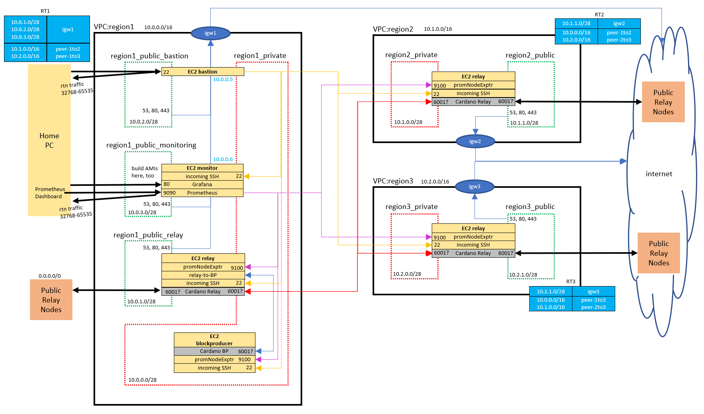

# cardano

The SPO directory contains all the terraform, ansible, and scripts required to setup a secure Cardano stake pool:
* Creates VPCs with VPC Peering, public/private subnets, security groups, IGs, Route Tables, and Network ACLs in multiple AWS regions
* Creates a bastion server and sets up access to the other nodes
* Provisions a monitoring server with Prometheus to gather metrics from all the nodes

## Setup

You'll need the directory `SPO/lookups/` created with the following files:
* my_home_ip.txt
    * contains the IP that will be allowed to login to bastion servers
    * example: ww.xx.yyy.zzz/32
* public_key.txt
    * the public key which will be used to setup bastion access
    * example: ssh-rsa XXXXXXXXXXXXXXXXXXXXXXXXXXXX
* private_key_path.txt
    * path to the local private key to be used with the public_key above
    * example: ~/.ssh/key.pem

# Running

From the `SPO` directory, run `terraform plan` to see what will be created. There are currently 55 items to be created. After running `terraform apply` to completion, the output section will list a number of items, including:
* `prometheus_url` - setup to monitor all the nodes in this stake pool
* `bastion_public_ip` - the SSH entry point to the system (only accessible from my_home_ip using the key at private_key_path)
* `<various private IPs>` - SSH to any other node by first logging in to the bastion and then using these private IPs

Access nodes in the system by first logging in to the bastion:
`ssh -i ~/.ssh/key.pem ubuntu@<bastion_public_ip>`

SSH to other internal nodes in the system from the bastion (same ssh key was copied to the bastion's .ssh dir):
`ssh -i ~/.ssh/key.pem ubuntu@<relay private IP>`
